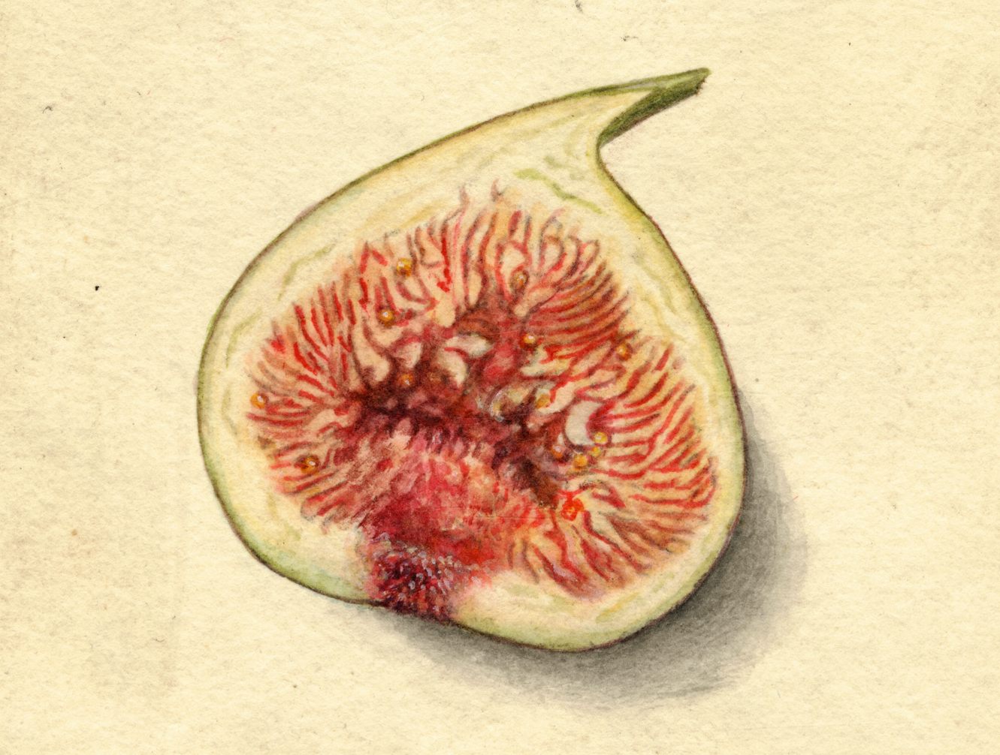

```{r setup, echo=FALSE, warning=FALSE, message=FALSE}
# Load packages.
library(tidyverse)
library(tidymodels)

# Import data.
data <- readRDS(params$data_path)
```

# Introduction

We can can include regular single-paper citations using `[@author:year]` like [@Allenby:1998] or multiple-paper citations using `[@author:year; @author:year]` like [@Allenby:1998; @Watanabe:2010], in-line citations using `@author:year` like @Allenby:1998, or citations without the Author using `[-@author:year]` like [-@Allenby:1998].

Each section and sub-section can be referenced using an automatically generated label using `\@ref(section-name)`. For example, we can reference the Model Specification section using `\@ref(model-specification)` as Section \@ref(model-specification).

# Model Specification

We can include math using LaTeX within the `$`, `$$`, or `\begin{equation}` and `\end{equation}` syntax. For example, `$y = \beta x + \epsilon$` produces $y = \beta x + \epsilon$ and

\begin{equation}
Pr(y_{n,h}=p|\beta_n) = \frac{\exp{(x_{p,h}'\beta_n)}}{\sum_{p=1}^P\exp{(x_{p,h}'\beta_n)}}
(\#eq:mnl)
\end{equation}

\noindent is produced using the `\begin{equation}` and `\end{equation}` syntax. The equation has to be labeled with `(\#eq:label)` so it can be referenced with `\@ref(eq:label)` like Equation \@ref(eq:mnl).

# Empirical Application

Using R Markdown means we can use Markdown, R, and LaTeX (along with other languages) interchangeably. To illustrate, while we can create a table using LaTeX or Markdown, we can also just print a data frame using `knitr::kable()` and the `kableExtra` package. The name of the code chunk is the label that can be referenced with `\@ref(tab:label)` like Table \@ref(tab:tab-data). For more table options, see the [kableExtra vignette](https://haozhu233.github.io/kableExtra/awesome_table_in_pdf.pdf).

```{r tab-data, echo=FALSE, fig.pos="H"}
knitr::kable(
  data[1:10,], 
  format = "latex", 
  align = "ll", 
  caption = "Included data.", 
  booktabs = TRUE
)
```

Similarly, while we can include a figure using LaTeX or Markdown, we can also use `knitr::include_graphics()`. Once again, the name of the code chunk is the label that can be referenced with `\@ref(fig:label)` like Figure \@ref(fig:fig-slug).

```{r fig-slug, echo=FALSE, fig.cap="A nice fig", out.width="50%", fig.align="center", fig.pos="H"}

```

# Results

```{r echo=FALSE}
click_prop <- data %>% 
  mutate(click_lvls = as.factor(click)) %>% 
  count(click_lvls) %>% 
  pivot_wider(names_from = click_lvls, values_from = n) %>% 
  mutate(click_prop = Yes/(No + Yes)) %>% 
  pull(click_prop)
```

Our tables and figures can be dynamic. In the YAML, we can include parameters under `params`. We've already imported data specified as a parameter, an `r params$data_name` example (the name itself being a parameter as well). We can use that data to produce dynamic results in tables or in-line, like `r round(click_prop * 100, 2)`% of click-through in the `r params$data_name`, and dynamic figures -- all updated with whatever new data or other parameters we set. As before, the name of the code chunk is the label that can be referenced, like Figure \@ref(fig:bar-plot).

```{r bar-plot, echo=FALSE, fig.cap="A bar plot.", fig.align="center", fig.pos="H"}
data %>% 
  ggplot(aes(x = design, fill = click)) +
  geom_bar()
```

# Conclusion

One final note. While the bibliography will be placed automatically at the end of the paper, we may have a few additional citations like R packages and other software to include that aren't explicitly cited elsewhere that we can include using the LaTeX syntax `\nocite{author:year, author:year}` (since we are using `natbib` for citations) as is demonstrated in the following bibliography.

\nocite{bayesm:2018, loo:2018}
